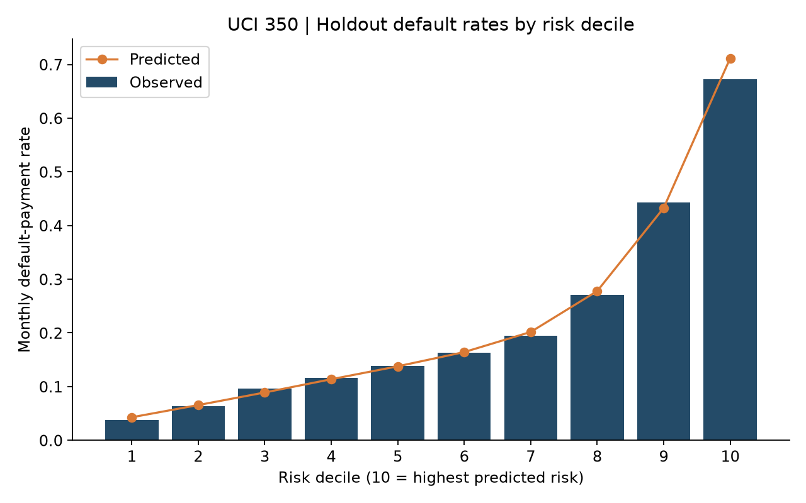
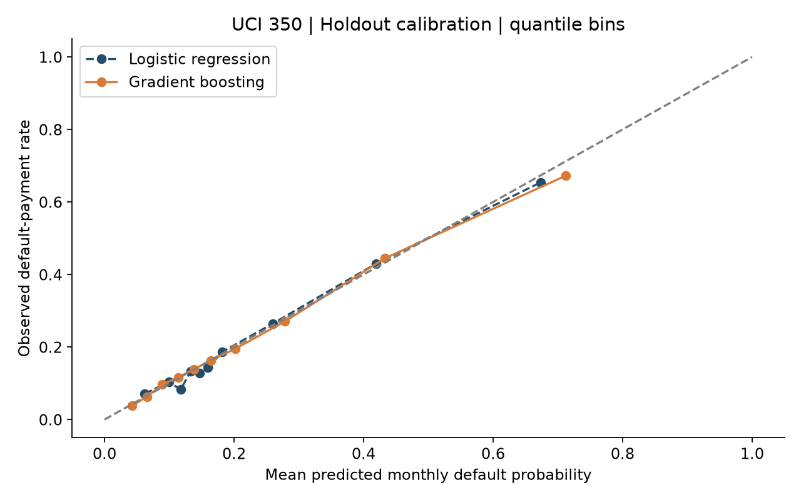
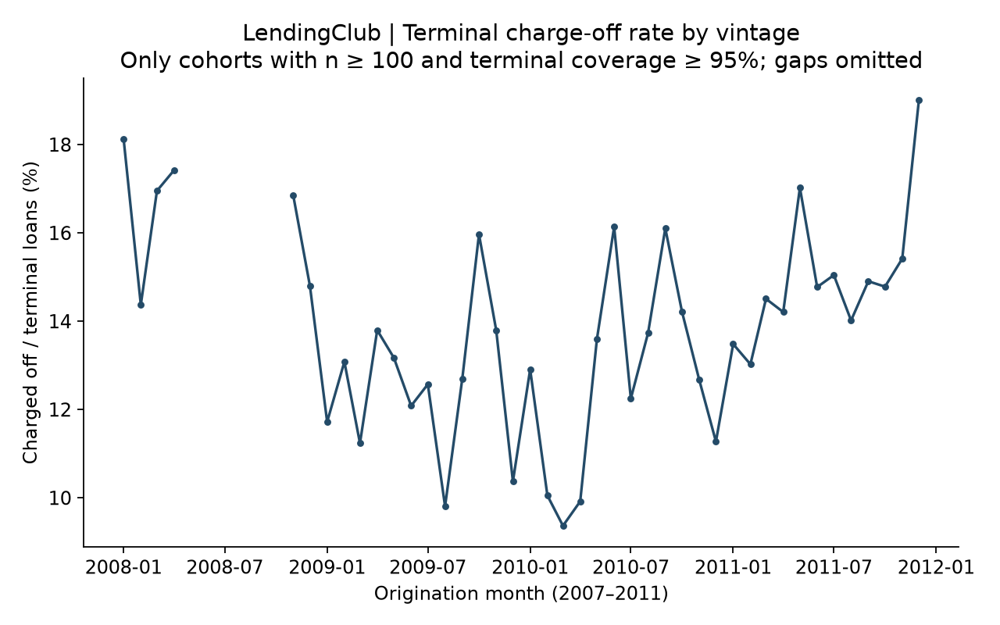
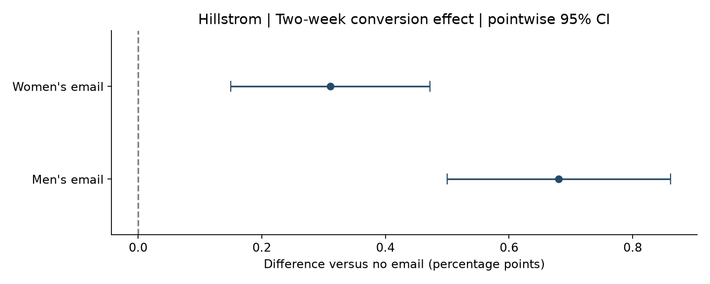

# Credit Risk Analytics Portfolio

[](https://github.com/Eminxe/Credit-risk-portfolio/actions/workflows/ci.yml)


**Emin Salavatov** · six reproducible risk-analytics case studies on public data, prepared for a
Risk Analyst application at [Plata](https://plata.mx) (Mexico).

The project covers the core loop of consumer-credit risk work: build and validate a probability-of-default
(PD) model, turn PD into expected loss and unit economics, set limits under a loss budget, monitor
population stability and vintages, and measure incremental effects with a randomized experiment.
It uses no private Plata data, and every monetary result is a declared scenario, not observed bank profit.

**Read first:** [Portfolio overview](PORTFOLIO_EN.md) · [Executed notebook](notebooks/01_06_casebook.ipynb) ·
[HTML casebook](outputs/casebook.html) · [Разбор на русском](РАЗБОР_RU.md)

## Results at a glance

| # | Business question | Data | Method | Key result |
|---|---|---|---|---|
| 01 | Who will miss next month's card payment? | UCI Taiwan credit cards, 30,000 clients | Calibrated logistic regression vs gradient boosting, grouped nested CV, untouched holdout, WoE/IV, PSI | Holdout **ROC-AUC 0.782** (95% CI 0.767–0.797), **Gini 0.564**, Brier 0.135 |
| 02 | What does that risk cost? | Case 01 scores | Monthly survival cash flows, EL = PD × LGD × EAD, sensitivity grid, EL by risk decile | Base scenario **NPV −723.8 M TWD**, EL 884.7 M TWD: the declared pricing does not cover risk |
| 03 | Which credit limit for each client? | Case 01–02 outputs | Discrete Lagrangian optimisation under a loss budget, dual bound | Lower limits improve scenario NPV by **+195.2 M TWD**; budget constraint is slack |
| 04 | Whom should a campaign call? | UCI Bank Marketing, 45,211 calls | Time-ordered train/validation/holdout, leakage removal, PSI drift report | Later-period **AUC 0.592**: an honest model-drift finding, not a deployment |
| 05 | Does an email actually increase sales? | Hillstrom randomized test, 64,000 customers | Intent-to-treat, Welch CIs, Holm correction, balance checks | Men's email **+0.68 pp conversion**, **+$0.77 spend/customer** |
| 06 | How do loan vintages perform? | LendingClub 2007–2011, 39,786 loans | Vintage and grade analysis with coverage rules; tested roll-rate function | **14.25%** terminal charge-off rate; grade A 6.0% → grade G 31.8% |

<table>
<tr>
<td></td>
<td></td>
</tr>
<tr>
<td></td>
<td></td>
</tr>
</table>

## Skills demonstrated

| Area | Where |
|---|---|
| PD modelling, calibration, ROC-AUC / Gini / KS / Brier, risk deciles | Case 01 · `src/plata_risk/credit.py` |
| Scorecard diagnostics: Weight of Evidence, Information Value, PSI | Cases 01, 04 · `src/plata_risk/scorecard.py` |
| Leakage control: grouped splits, nested calibration, excluded post-event fields | Cases 01, 04 |
| Expected loss, LGD / EAD, discounted cash flows, break-even PD | Case 02 · `src/plata_risk/economics.py` |
| Constrained optimisation of credit limits | Case 03 |
| Experiment analysis: ITT, confidence intervals, multiple testing | Case 05 · `src/plata_risk/experiment.py` |
| Portfolio monitoring: vintages, grade mix, roll rates | Case 06 · `src/plata_risk/portfolio.py` |
| SQL, PostgreSQL, Docker, CI, unit tests, reproducibility | `sql/`, `docker/`, `.github/`, `tests/` |

## Quick start

Requires Docker Desktop (Linux containers). Python 3.12 runs inside the container.

```bash
bash scripts/bootstrap.sh          # Linux / WSL: creates .env and builds the image
make pipeline                      # downloads public sources and runs all six cases
make validate                      # tests, reconciliation, SQL load, notebook execution
make jupyter                       # JupyterLab on http://localhost:8888 (token in .env)
```

On Windows PowerShell use `.\scripts\run_local.ps1 -Task setup|pipeline|validate|jupyter|package`.
Single cases: `make case01` … `make case06`. Without Docker, with Python 3.12:

```bash
pip install -r requirements-linux.lock && pip install --no-deps -e '.[dev]'
pytest -q && python scripts/run_pipeline.py
```

## Repository layout

```text
cases/            six executable studies (case01 … case06)
src/plata_risk/   data loaders, scoring, scorecard diagnostics, economics, statistics, plots
configs/          every financial and analytical assumption, in YAML
scripts/          pipeline, independent verification, SQL loaders, notebook build, packaging
sql/, docker/     PostgreSQL schema and portfolio summary queries
tests/            unit tests with hand-checked formulas and edge cases
notebooks/        executed English casebook
outputs/          published aggregate evidence (raw data, row-level scores and models are not committed)
docs/figures/     key charts from the validated run
```

## Validation

GitHub Actions runs lint, unit tests and the Docker build on every push. On `main` and on manual
runs it also downloads all sources afresh, executes the six cases, reconciles every output against
an independent calculation, loads PostgreSQL twice to prove idempotence, executes the notebook and
uploads the evidence. The last full run is documented in [CI_RESULT.md](CI_RESULT.md).
Source data are cached with SHA-256 receipts; the pipeline fails rather than substituting synthetic data.

## Data sources and limitations

- [UCI Default of Credit Card Clients](https://doi.org/10.24432/C55S3H) and
  [UCI Bank Marketing](https://doi.org/10.24432/C5K306), CC BY 4.0.
- [Hillstrom MineThatData e-mail challenge](https://blog.minethatdata.com/2008/03/minethatdata-e-mail-analytics-and-data.html)
  and the [original LendingClub LoanStats3a archive](https://resources.lendingclub.com/LoanStats3a.csv.zip):
  no redistribution licence is established, so raw files are never committed.

Case 01 uses grouped random validation on 2005 Taiwanese data, so it is not an out-of-time or
regulatory (IFRS 9 / CNBV) PD. LGD, utilisation, prices and the limit-response elasticity are
scenario assumptions in `configs/`, not measured bank parameters. Cases 04–06 are separate
populations and are never joined to Case 01 clients. Further details: [STRUCTURE.md](STRUCTURE.md),
[RUNBOOK.md](RUNBOOK.md), [EXECUTION_STATUS.md](EXECUTION_STATUS.md).

This project was developed with AI coding assistance; the inspectable code, tests and stated
limitations are the evidence. Code is released under the [MIT License](LICENSE); data remain under their own terms.
